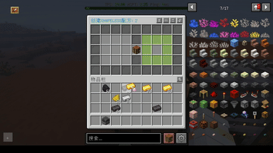
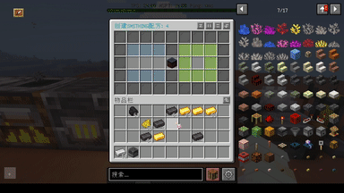
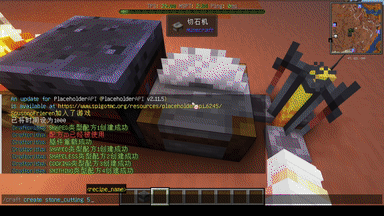
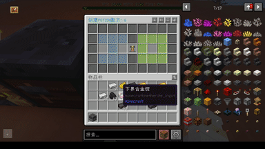
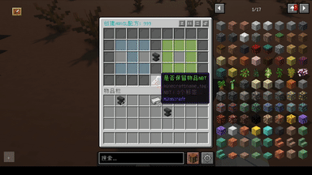
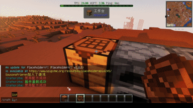
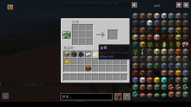

<h1>Craftorithm</h1>
<h6>合成配方管理系统</h6>

----
Craftorithm是一个合成配方管理插件，可以添加各类配方，并可以进行合成限制，删除/禁用配方等管理操作

## 特性

### 添加有序配方

### 添加无序配方

### 添加烧炼配方(熔炉、高炉、烟熏炉、营火)

### 添加锻造配方

### 添加切石配方

### 添加酿造配方

### 添加铁砧配方

### 查看配方

### 禁用配方

## 使用方式
#### [Craftorithm Wiki](https://yufiriamazenta.gitbook.io/craftorithm-wiki/)

## bStats

## 下载

#### [spigotmc](https://www.spigotmc.org/resources/craftorithm-customized-crafting-management-plugin-1-13-1-20-folia-supported.108429/)

#### [mcbbs](https://www.mcbbs.net/thread-1313942-1-1.html)

#### [Modrinth](https://modrinth.com/plugin/craftorithm)

